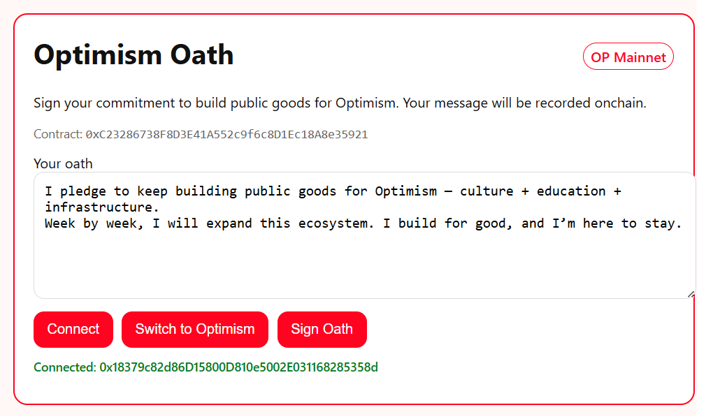

# 🔴 Optimism Oath — The Public Goods Pledge

An onchain pledge for Optimism builders.  
Anyone can sign their Oath on OP Mainnet and leave a permanent mark onchain.

> Contract: 0xC23286738F8D3E41A552c9f6c8D1Ec18A8e35921  
> Explorer: [View on Optimism Etherscan](https://optimistic.etherscan.io/address/0xC23286738F8D3E41A552c9f6c8D1Ec18A8e35921)  
> Live site: https://stephanschwab.github.io/Optimism-Oath/

---

## ✨ Features
- 🦊 Connect with MetaMask / Rabby  
- 🔴 Switch to Optimism (chainId 10)  
- 📝 Customizable oath text  
- 📜 Onchain proof via event OathSigned  
- 🧾 Last oath stored in lastOath(address)

---

## 🚀 How to Sign
1. Open the [Live site](https://stephanschwab.github.io/Optimism-Oath/)  
2. Click Connect Wallet  
3. Switch to Optimism (if not already)  
4. Review or edit your message  
5. Hit Sign Oath → confirm in wallet  
6. 🎉 Your pledge is now onchain!  


_Default oath text:_

I pledge to keep building public goods for Optimism — culture + education + infrastructure.
Week by week, I will expand this ecosystem. I build for good, and I’m here to stay.

---

## 🧩 How it Works
- Smart contract: OptimismOath (Solidity 0.8.24)
- Core function:
  ```solidity
  function signOath(string calldata message) external

Emits:
event OathSigned(address indexed signer, string message, uint256 timestamp);

• Anyone can sign.
 • Last oath per address is stored onchain.

---

## 📸 Screenshot

Here is how the Optimism Oath page looks on GitHub Pages:




📚 Learn More

Explore the broader ecosystem of Optimism public goods —
books, NFTs, bots & more: Build For Good — GitHub (https://github.com/stephanschwab/build-for-good)

⸻

📝 License

MIT — open source, free to use, remix, and build upon.
